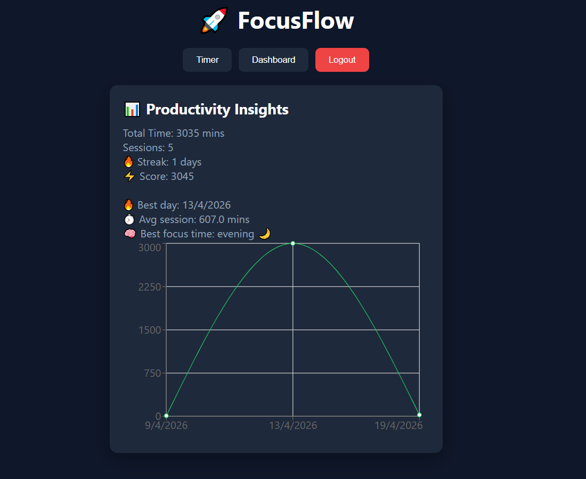
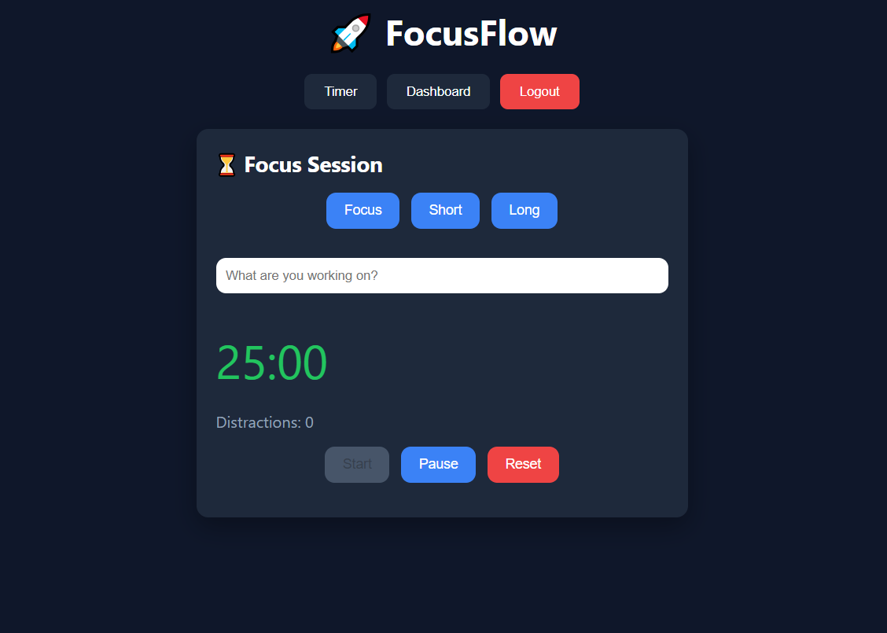

# 🚀 FocusFlow – Productivity Tracker

## About the Project

FocusFlow is a simple productivity app I built to help users stay focused using the Pomodoro technique. While working on this project, my goal was not just to create a timer, but to build something that actually helps track and improve focus habits over time.

The app allows users to run focus sessions, store their work data, and visualize their productivity through a dashboard.

---

## What it does

- Start focus sessions using a timer (25 mins, short break, long break)
- Save each session with task details
- Track total focus time and number of sessions
- Show daily progress using charts
- Calculate streaks based on consistent usage
- Generate simple insights like average session time and best focus period
- Detect when the user switches tabs and track distractions

---

## Tech Used

- React (Frontend)
- Firebase Authentication (Login/Signup)
- Firestore (Database)
- Recharts (for graphs)

---

## Screenshot
###  Dashboard Page
  
### 🔐 Login Page


### 📊 \Interface


---


## Environment Setup

Create a `.env` file and add Firebase configuration:

```
VITE_FIREBASE_API_KEY=______
VITE_FIREBASE_AUTH_DOMAIN=____
VITE_FIREBASE_PROJECT_ID=______
```

---

## What I Learned

While building this project, I got hands-on experience with:

- Managing state and side effects in React
- Working with Firebase for authentication and database
- Designing a simple but useful user interface
- Handling real-world problems like tab switching and user distractions
- Structuring a project in a scalable way

---

## Future Improvements

- Add mobile responsiveness
- Improve UI/UX design
- Add more detailed analytics
- Introduce AI-based productivity suggestions

---

## Author

D.Sai Nikhil :)
